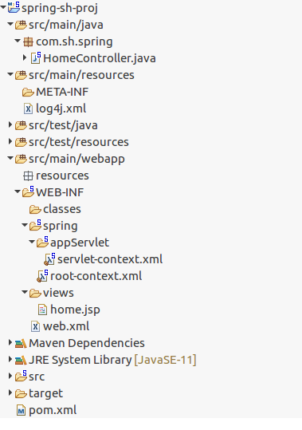

# 1.1 스프링 IoC 컨테이너와 빈의 도입 

* <I>제어의 역전 (IoC) 원리</I>
* <I>ApplicationContext & BeanFactory</I>
* <I>Bean</I>

 

### 제어의 역전 (IoC = Inversion of Control = "대신 해준다")
제어의 흐름 구조가 뒤 바뀌는 것 
외부에서 제어를 한다!! 외부는 "컨테이너"이다. 
 

<b>일반적인 제어의 흐름</b> 
오브젝트가 모든 제어 권한을 스스로 갖는다.  
main() 메서드와 같이 프로그램이 시작되는 지점에서 사용할 오브젝트를 결정하고 결정한 오브젝트를 생성하고 만들어진 오브젝트에 있는 메서드를 호출하고 그 오브젝트 메서드 안에서 다음에 사용할 것을 결정하고 호출하는 식의 작업을 반복한다. 

<b>역전된 제어의 흐름</b> 
오브젝트가 모든 제어 권한을 자신이 아닌 다른 대상에게 위임한다.  
프로그램의 시작을 담당하는 main()과 같은 엔트리 포인트를 제외하면 모든 오브젝트는 제어 권한을 위임받는 특별한 오브젝트에 의해 결정되고 만들어진다. 따라서, 오브젝트가 자신이 사용할 오브젝트를 스스로선택하지 않으며 생성하지도 않는다. 자신이 어디서 생성되고 사용되는 지 알 수도 없다. 

 
제어의 역전에서는 프레임워크 또는 컨테이너와 같은 어플리케이션 컴포넌트의 생성과 관계 설정, 사용, 생명 주기 관리 등을 관장하는 존재가 필요하다. 단순한 적용이라면 IoC 제어권을 가진 오브젝트를 분리해서 만드는 방법이면 충분하겠지만, IoC를 애플리케이션 전반에 걸쳐 본격적으로 적용하려면 스프링과 같은 IoC 프레임워크의 도움을 받는 편이 훨씬 유리하다.  

프레임워크에서 이 제어권을 가지는 것이 컨테이너. 객체에 대한 제어권이 개발자로부터 컨테이너에게 넘어가면서 객체의 생성부터 생명주기 관리까지의 모든 것을 컨테이너가 맡아서 한다.  

IoC는 스프링의 고유한 방식이 아니다. 스프링이 IoC 방식을 철저하게 사용하는 것일 뿐이다.
대부분 프레임워크에서 IoC를 적용한다. 스프링이 다른 프레임워크와 차별화를 두고 제공하는 기능은 DI이다. 

https://frontierdev.tistory.com/76

  
### ApplicationContext & BeanFactory

<b>스프링 컨테이너 (= IoC 컨테이너)</b> 
IoC 방식으로 오브젝트(빈)를 관리하는 컨테이너. 
오브젝트에 대한 제어권을 넘겨받아, 오브젝트 생성과 관계, 사용, 생명 주기 등을 관장한다.
오브젝트 간의 의존성을 낮추기 위해 사용된다. 객체를 외부에서 설정해서, 외부에서 설정한 객체를 주입하는 방식!   

스프링 컨테이너는 아래와 같은 과정으로 스프링 프레임워크를 초기화한다. 
1. 스프링 컨테이너 생성
2. 빈들이 정의된 XML이 읽어들여짐
3. XML 파일에 등록된 빈들의 라이프 사이클과 디펜던시가 관리되기 시작함  

스프링에서 IoC 컨테이너 역할을 하는 것이 BeanFactory와 Application이다.  
<bean> 저장소에 해당하는 XML 설정 파일을 가지고, <bean>의 라이프 사이클을 관리한다!!

<b>org.springframework.beans.factory.BeanFactory</b> 
구현클래스: XmlBeanFactory - XML 파일에 기술되어 있는 정의를 바탕으로 빈을 로딩해준다. (로딩 해주면, 로딩된 빈을 getBean을 통해 호출할 수 있다)  
스프링 설정 파일(applicationContext.xml)에 등록된 <bean> 객체를 생성하고 관리하는 가장 기본적인 컨테이너 기능만 제공한다. 컨테이너가 구동될 때 객체를 생성하는 것이 아니라, 클라이언트로부터 요청이 들어왔을 때에 객체를 생성한다. lazy loading 방식! 

<b>org.springframework.context.ApplicationContext</b> 
구현클래스: ClassPathXmlApplicationContext - 클래스패스에 위치한 하나의 설정 파일을 읽어온다. , FileSystemXmlApplicationContext - 지정 경로에 위치한 여러 설정파일을 읽어온다. (빈은 미리 로딩되어 있으므로 바로 getBean을 통해 호출할 수 있다)  
BeanFactory를 확장한 컨테이너로, 트랙잭션 관리나 메시지 기반의 다국어 처리 등 다양한 기능이 추가된다. 컨테이너가 구동될 때, <bean> 객체가 생성된다. 즉시 로딩 방식! 

  
### "Beans"?
스프링에서 POJO(plain, old java object)를 말하며, 스프링 IoC 컨테이너에 의해 생성, 관리된다. Beans는 컨테이너에 공급하는 설정 메타 데이터(XML 파일)에 의해 생성된다. 컨테이너는 이 메타 데이터를 사용하여 빈 생성, 관계 설정, 라이프 사이클을 읽는다. 객체는 getBean() 메서드를 통해 가져올 수 있다. 

  

# 1.2 컨테이너

* <I>ApplicationContext 동작 원리 및 구현</I>
* <I>Configuration 메타 데이터</I>

 

### ApplicationContext 동작 원리 및 구현
 

<b>스프링 프로젝트 패키지 구성</b> 

## Configuration 메타 데이터
 

  

# 1.3 빈의 개요

